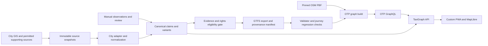
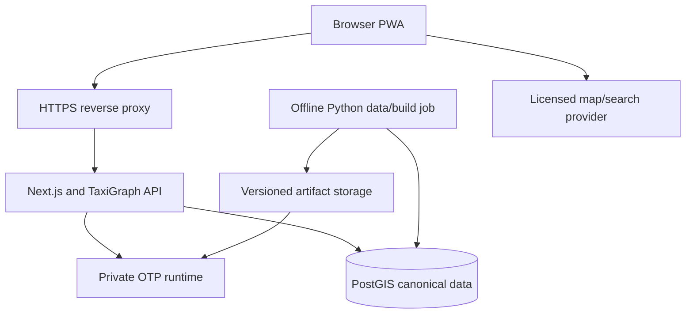

# Selected architecture

Status: selected design, **real-data feasibility unproven**. See [research](RESEARCH.md), [data rights/profile](DATA-SOURCES.md), [decisions](ADR.md), and [release gates](MVP-SPEC.md).

## Decision: option A, staged

Use a custom TaxiGraph API/client with **OpenTripPlanner + GTFS + OSM**. Own a canonical informal-transit model and verification/export rules. Use **files first**, introduce **PostGIS after the feasibility gate**, and build **Next.js/TypeScript + MapLibre** only after real journeys pass. Python is the data-job language because Shapely/pyproj and the GIS ecosystem cover the difficult spatial primitives. TypeScript owns the eventual browser and API. OTP remains an unmodified Java service.

The user's proposed end-state pipeline is sensible, but a database, general adapter framework and frontend are unnecessary to answer the immediate question. The hypothesis that GIS geometry alone can produce useful operational GTFS is falsified by the missing fields and conflicting records. The next uncertainty is whether affordable manual verification makes a small, useful subset viable.

## Alternative comparison

Ratings are architectural judgments for one student, not measured benchmarks. All options have the same underlying evidence and data-rights obligations.

| Criterion | A: custom web + OTP | B: Trufi app/infrastructure + OTP | C: custom web + PostGIS/pgRouting/custom logic |
|---|---|---|---|
| Original code | Moderate: data quality, export mapping, API, focused UI | Less initial UI, similar Cape Town data work, adaptation code | Highest: data/UI plus transit-state and pedestrian integration |
| Mature reuse | OTP, OSM, validator, geometry libraries, MapLibre | Same core infrastructure plus Flutter components | Spatial algorithms mature; assembled transit planner remains ours |
| Informal-taxi suitability | Evidence-backed frequency model; gaps explicit | Existing informal workflows, but defaults need correction | Flexible topology model; cannot discover missing service facts |
| Model flexibility | Canonical model independent of GTFS | Possible if kept independent; Core/OSM assumptions add friction | Maximum, with more responsibility |
| Hosting | In-memory OTP plus small app and later database | Can match A; full Trufi services add .NET/Photon/tiles/analytics | Database alone initially; mature walking/transit support adds services/work |
| Mobile | Focused PWA; measure map and network costs | Flutter native reuse; web bundle/performance still needs measurement | Custom client; routing performance is an additional risk |
| Offline | Saved routes/app shell first; full routing deferred | Existing native local planner/search; different walking semantics | Possible, but would need a packaged graph/runtime |
| Expansion | City adapter + versioned canonical contract | Strong city-app pattern; verify backend assumptions per city | Flexible but every city increases custom routing obligations |
| One-student maintenance | Manageable when phased; two application languages justified by roles | Attractive for Flutter expertise, less so for a custom web product | Weakest: substantial correctness and operations surface |
| Testability | Fixtures, standard validator, black-box journey tests | Similar plus framework/provider compatibility | Must validate routing algorithms and integration as well |
| Interview explanation | Defensible data engineering and reuse boundary | Defensible if original data work is explicit | More algorithm code, but higher chance of an unreliable system |
| Licensing | OTP LGPL; MapLibre BSD; source data separately reviewed | Core GPL; several newer server licences unresolved | pgRouting GPL; data and other dependencies still reviewed |
| Reskin risk | Low: distinct canonical data/evidence/API/product | Higher if only branding changes; lower with substantial data engineering | Low visual reskin risk, high reinvention risk |

**Select A.** B does not eliminate the Cape Town data gap and its turnkey defaults are unsuitable. C adds generic routing work without obtaining the missing facts. Reuse selective Trufi ideas/components where a later task demonstrates a smaller, licence-compatible integration; do not adopt its stack wholesale.

## Boundaries and flow

Graph acceptance includes evaluation **after** build; GTFS validation alone cannot approve a graph. Unqualified canonical records remain reviewable but never enter the passenger graph.

| Component | Responsibility | Explicit boundary |
|---|---|---|
| City adapter | Fetch approved source snapshots, capture rights/schema, reconcile IDs/counts, map source claims | No inference of operating schedules; no routing |
| Normalization/review | Geometry quality, candidate duplicates, direction/boarding assertions, conflict history | Human/evidence gate for semantic merges |
| Canonical store | Versioned source, route/variant, boarding, service, fare and verification records | Files for spike; PostGIS for durable private MVP; GTFS is not master data |
| Export adapter | Map only eligible records to bounded GTFS; stable ID map and evidence manifest | Reuse CSV/ZIP tools and validator; no generic parser framework |
| OTP | OSM street graph, transit search, access/egress, transfers, itinerary geometry | Does not score source truth or know informal local practice |
| TaxiGraph API | Request validation, covered-area check, OTP adapter, evidence enrichment, stale/withdrawn checks | No parallel pathfinding algorithm; public schema independent of OTP |
| Client | Origin/destination input, walk/taxi/transfer explanations, provenance, map | No raw OTP dependency or inference that an engine timestamp is a promised departure |
| Map/search providers | Licensed basemap assets and eventual geocoding | Separate from taxi service evidence; no automatic use of public OSM services as production CDN |

TaxiGraph's original engineering is the auditable transformation from imperfect source records to usable journey information, especially identity conflicts, export eligibility and evidence-aware presentation. Reusing OTP is a central engineering decision, not a loss of ownership.

## Integration contracts

- **Adapter boundary:** source bytes + snapshot manifest -> canonical candidate records + structured issues. One Cape Town function/module first; extract an interface after a second real adapter. Keep `city_id`, source identity and timezone explicit now. Future OSM and GTFS adapters may preserve richer fields without pretending they are identical source formats.
- **Canonical contract:** versioned JSON Schema shared by Python and TypeScript. Preserve unknown, inferred, observed, reported and contradicted assertions. SQL is a storage mapping of this contract.
- **Export artifact:** ZIP + canonical-to-GTFS ID map + SHA-256 checksums + source/evidence versions + validity interval + exporter/config version + exclusions report. No real export when operating/boarding evidence or required use rights are missing.
- **OTP boundary:** POST GraphQL to `/otp/gtfs/v1` on a private network. Spike introspects the pinned release, saves its schema/query, and asserts route/trip/stop IDs survive response mapping. Cap timeouts and request size. No public GraphQL proxy accepting arbitrary queries.
- **Public API (later):** `POST /v1/journeys`, `GET /v1/routes/{id}`, `GET /v1/datasets/{version}`, `GET /v1/coverage`. Request coordinates and departure time with timezone context. Responses include dataset/graph IDs, service validity, walk/taxi legs, boarding instructions, evidence status, estimate labels, and structured reasons for no result.
- Distinguish `outside_coverage`, `insufficient_verified_data`, `outside_verified_service_window`, `no_journey_found`, and `routing_unavailable`. An uncovered route is not proof that no taxi exists.
- Suppress unsupported precise departure/arrival promises. If elapsed-time estimates are shown, identify their basis and uncertainty; hiding timestamps alone does not fix a graph built with fabricated values.

## Deployment topology

### Feasibility

One local command-line project and a loopback-only OTP process/container. Local files replace a database. Use artificial, clearly named fixtures for the software smoke test; use separately gated real evidence for Cape Town evaluation. No Next.js, geocoder, tileserver, queue or public host.

### Private/public MVP, after gates

Start on one adequately sized Linux host with containers and persistent storage; production graph builds may run on a separate workstation/job if peak memory competes with service traffic. Hosting choice/cost remains unmeasured. Do not place the long-lived OTP JVM in a short-duration serverless function. No Kubernetes, message broker, Redis or microservice mesh for MVP.

Promote a complete artifact bundle atomically: graph, GTFS ID map, canonical snapshot reference, and manifest. API/runtime must report the same graph ID. Keep the previous bundle for rollback and test restoration. OSM and GTFS changes rebuild appropriate artifacts; PostGIS edits alone do not update OTP. A withdrawal must suppress affected results immediately and trigger a rebuild, not wait for the next scheduled import.

Measure build peak RSS, runtime RSS, graph size, cold start, and representative query latency. Begin with a buffered corridor extract. Increase geography only when the validation corpus and host measurements justify it. Treat backup/restore, bounded logging, rate limits, and handling provider outages as public release tasks.

## What is deliberately deferred

Full offline routing, arbitrary continuous boarding, Flex, fare optimization, live vehicle tracking, community accounts/reputation, other cities, other transit modes, bulk public data export, and a generalized adapter/plugin system. A future offline map is not the same as offline routing. Expand only through an ADR and new evidence.
