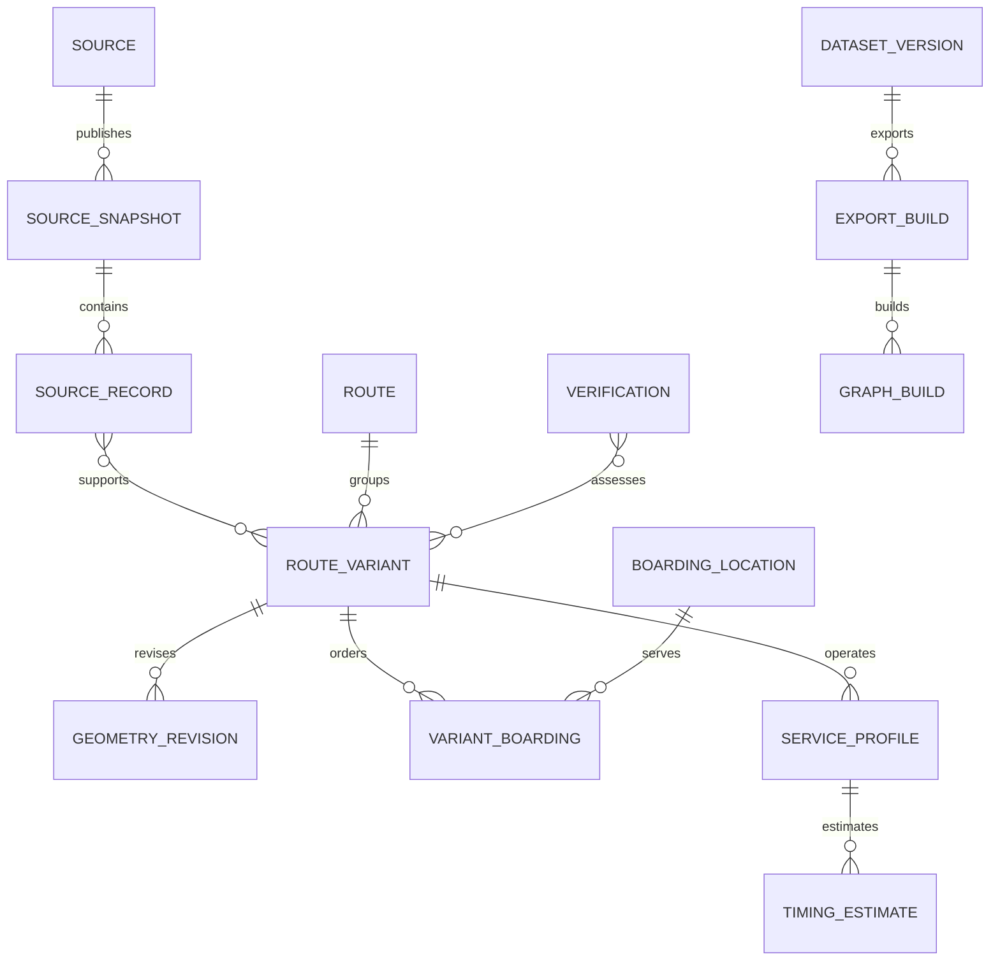

# Canonical informal-transit model

Conceptual design only; no migrations or classes are implemented. Start with a small versioned JSON contract; map it to PostGIS after feasibility. The model must retain incomplete source information even when it cannot enter routing. See [export policy](DATA-SOURCES.md) and [architecture](ARCHITECTURE.md).

## Core rules

1. A source record is not automatically a route, and a line is not automatically a service pattern.
2. IDs are stable TaxiGraph identities, namespaced by city. Source IDs identify records within a source/layer; GTFS IDs are stable derived identifiers with an explicit mapping.
3. Facts have evidence and validity. Geometry, direction, boarding, service and fare can have different confidence and dates.
4. Unknown is represented explicitly. Keep contradictory assertions; one successful import cannot overwrite a field observation without review.
5. Separate an immutable source snapshot, a canonical release, and an OTP graph build. They have different lifecycles.

## Entities

| Entity | Essential fields/relationships | Uncertainty and constraints |
|---|---|---|
| City | `city_id`, display name, timezone, declared coverage | Coverage means tested product coverage, not all source extent |
| Source | `source_id`, publisher/custodian, URL, layer ID, format, source CRS, attribution, rights text/reference, allowed-use scope | Public access and reproduction rights are separate. Licence status: unresolved, restricted, permitted |
| SourceSnapshot | `snapshot_id`, source FK, retrieval UTC, request parameters, schema hash, raw-byte hash, source version/publication/update metadata, record count, acquisition issues | Missing source dates stay null. A failed/truncated run cannot be approved |
| SourceRecord | snapshot FK, source-local record ID, raw attributes/geometry reference, content hash | Unmodified original values; source ID may be recycled between snapshots |
| Route | `route_id`, city FK, normalized display label, optional public ref/operator/network, route-family status, source links | Initially candidate route per source lineage; grouping variants is a reviewed hypothesis. Generated labels are marked generated |
| RouteVariant | `variant_id`, route FK, geometry revision FK, origin/destination references, direction status, optional counterpart, service status | Distinct directed path/pattern. Unknown orientation does not permit traversal in either direction |
| GeometryRevision | geometry ID, WGS84 LineString/MultiLineString, original CRS/reference, derivation method/version, metric QA report, hash, parent revision | Preserve ordered parts and original geometry. No silent flattening, reversing, densifying, or repair. Self-crossings are not automatically errors |
| Place | `place_id`, raw and normalized name/aliases, optional point/area, kind, evidence links | Endpoint locality may be an area or ambiguous text; never pretend its centroid is a rank |
| BoardingLocation | `boarding_id`, point, optional rank/place parent, name and naming method, kind, accessibility claims, evidence | Kind: verified rank entrance/platform, verified informal boarding point, candidate inferred point. “Inferred” is not “verified” |
| VariantBoarding | variant FK, boarding FK, sequence, shape measure, pickup/drop-off rule, direction/road-side evidence | Many-to-many; a rank's existence does not prove a particular route serves it. Repeated visits require different sequence entries |
| TransferAssertion | from/to variant-boarding references, allowed/forbidden/unknown, pedestrian entrance references, evidence, validity | Optional explicit transfer constraints; OTP computes pedestrian paths. Spatial proximity alone is only a review candidate |
| ServiceProfile | service ID, variant FK, timezone, days/date exceptions, window start/end, effective dates, kind | Kind: unknown, reported-window, observed-frequency, published-schedule, departure-when-full. Null days mean unknown, not every day |
| TimingEstimate | service/segment FK, estimate type, value/range, units, sample/method, observation window, validity, uncertainty | Separate headway, in-vehicle duration, dwell and transfer walking. Do not coerce departure-when-full into fixed frequency without supporting evidence |
| FareAssertion | scope (route/variant/OD/segment), amount/range, currency, rider conditions, payment/transfer conditions, evidence, validity | Unknown amount is null; zero explicitly means free. No universal flat-fare assumption. Fare tables remain absent until supported |
| Verification | `verification_id`, subject and field/claim, method, observed_at, submitted_at, reviewer, evidence reference, outcome, effective interval | Outcome: supports, contradicts, inconclusive, withdrawn. Private verifier identity separate from public summary |
| Assertion | subject/field, value, evidence links, status, valid interval, supersedes link | Logical envelope for uncertain fields, not a requirement to build an EAV database. Typed records plus an evidence table are enough |
| ConfidenceAssessment | subject/dimension, rule version, categorical status, reasons, assessed_at, freshness assessment | No invented probability. Assessment derived from evidence, not number of duplicate records |
| DatasetVersion | immutable release ID, source snapshots, canonical schema version, transform/code revision, review selections, rights scope, coverage, effective interval | Version pins a consistent set of claims; do not mix current claims with an older graph invisibly |
| ExportBuild | export ID, dataset version, profile (synthetic/real), GTFS checksum, canonical-ID map, exclusions, validator reports | Synthetic artifacts must never be promoted to real. All published GTFS IDs resolve back to a claim/version |
| GraphBuild | graph ID, export FK, OSM version/hash, OTP version/JAR hash, configs/hash, build issues, test report, artifact checksum | Derived and rebuildable. Promotion/rollback selects a complete bundle |

## Relationships

The diagram is intentionally incomplete: fare/field-level evidence can reference more than a variant, and a dataset selects many source snapshots and entity revisions. No new generic graph database is needed.

## Identity, normalization and geometry

- Retain `ORGN=" "` as raw input and normalize it to unknown. Whitespace/case normalization is mechanical; deciding that `MITCHELLS PLAIN` and `MITCHELL'S PLAIN` identify the same locality is an alias decision with traceability.
- Seed deterministic candidate IDs from a stable source namespace and source-record lineage. Snapshot ID is not part of the enduring route ID. Detect source-ID reuse by content changes; queue semantic reassignment for review.
- Hash equality is an exact duplicate candidate. Near duplicates use metric comparisons plus endpoint/name evidence. Store proposed merge reason, reviewer, accepted/rejected state and old-to-new aliases. Never discard the conflicting source lineage; records 20/127 prove why.
- Route-family membership and opposite-direction pairing can remain unresolved. Digitization direction, GTFS `direction_id`, and a compass bearing are different things. A reverse shape is never automatically a reverse service.
- A variant can loop and revisit a boarding point. Store sequence and distance along a particular geometry revision; nearest-point matching alone is ambiguous on loops. Metric calculations use EPSG:32734 for the Cape Town work, with longitude/latitude only at exchange boundaries.

## Service and time semantics

Keep timestamps UTC; service dates and seconds since local service-day start use the city's timezone. Represent overnight intervals explicitly; preserve GTFS values beyond 24:00. Operating-window knowledge does not imply knowledge of departures within that window. An observation on one morning cannot support an all-year calendar or weekends.

Minimum evidence for a real frequency export: actual directed boarding pattern, a verified limited service/date window, a defensible frequency estimate for that window, and defensible relative travel offsets. Store the raw observations, method, sample count, range and limitations. A declared operator frequency and an observed estimate must remain distinguishable. If headway is not meaningful for the service, mark that representation unsuitable and stop the gate; do not choose a convenient constant.

For early verification, only retain facts supported by the supplied observation dates or explicitly confirmed recurring windows. Public validity horizons require a documented refresh/review policy. The maintainer defines that policy from evidence before release; this document does not invent a fixed decay period.

## Confidence and freshness

Use a dimension vector: `geometry`, `direction`, `boarding`, `service_window`, `timing`, `fare`. Each carries `unknown`, `inferred`, `reported`, `observed`, or `contradicted`, plus evidence IDs and `stale/expiry_unknown/current_for_declared_window`. These are evidence categories, not numeric rankings that can be averaged.

Routing eligibility is a rule evaluated across required dimensions and rights scope. Missing fare does not block routing; missing direction, boarding or service timing does. A contradiction in a required dimension blocks promotion pending review. Unreviewed official geometry may still be useful for a catalogue, if use rights allow it.

Journey confidence exposes the weakest required evidence and all material caveats. Do not average one unverified transfer into an apparently high score. Retrieval recency cannot raise operational freshness. Community submissions create pending evidence; they do not immediately mutate the active graph.

## Canonical to GTFS projection

Preserve a stable map for route, trip, stop, service and shape IDs. Encode minibus as interoperable bus mode while retaining `minibus_taxi` in TaxiGraph. Keep TaxiGraph as feed publisher; resolve operator/agency representation explicitly without attributing taxi operation to the City. Use bounded service validity and omit unsupported optional fares. Keep detailed evidence, confidence, merge history and licence scope in the canonical store and export manifest; do not expect OTP to preserve arbitrary extra GTFS columns.

## Deferred concepts

Generic observation event streams, contributor reputation, live capacity, vehicle identity, fare optimization, full GTFS import semantics, booking/Flex zones and cross-city operator unification are not required for the first schema. Add fields when a real source/task requires them. Preserve raw source extension attributes rather than prematurely flattening every future city's data.
